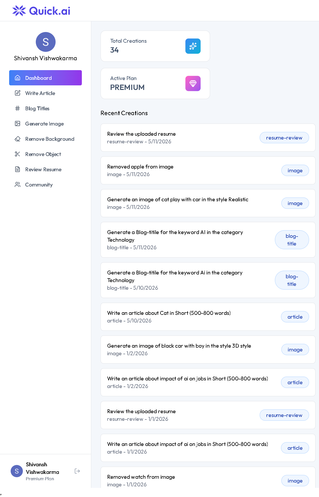
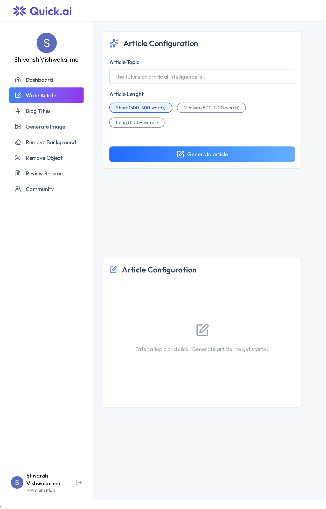
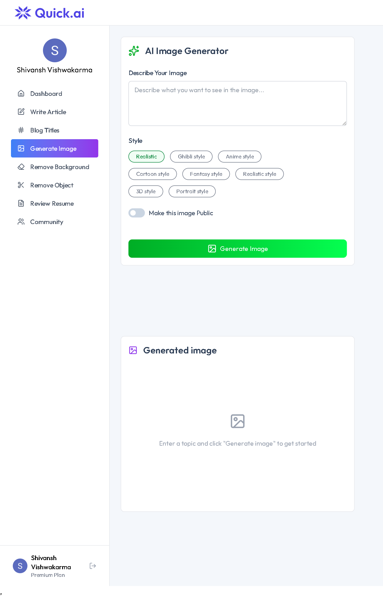
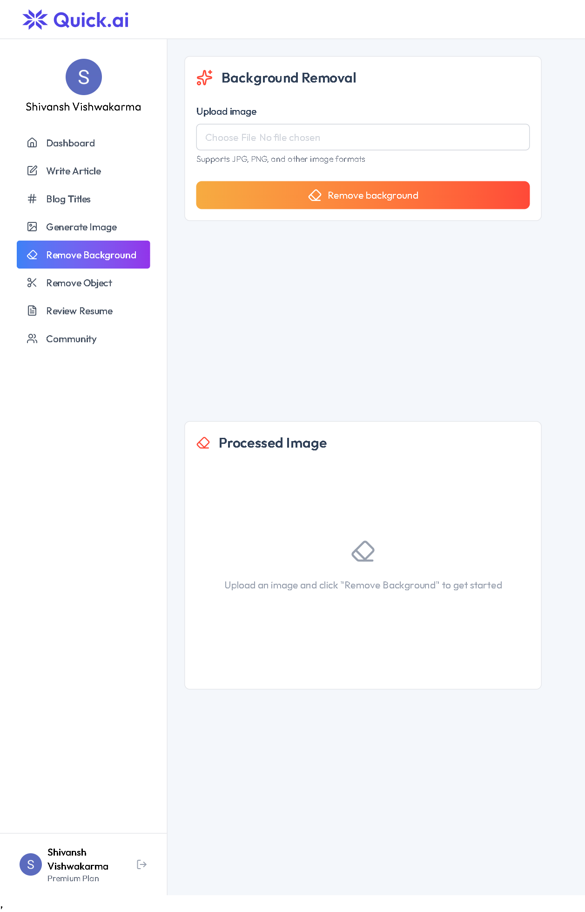
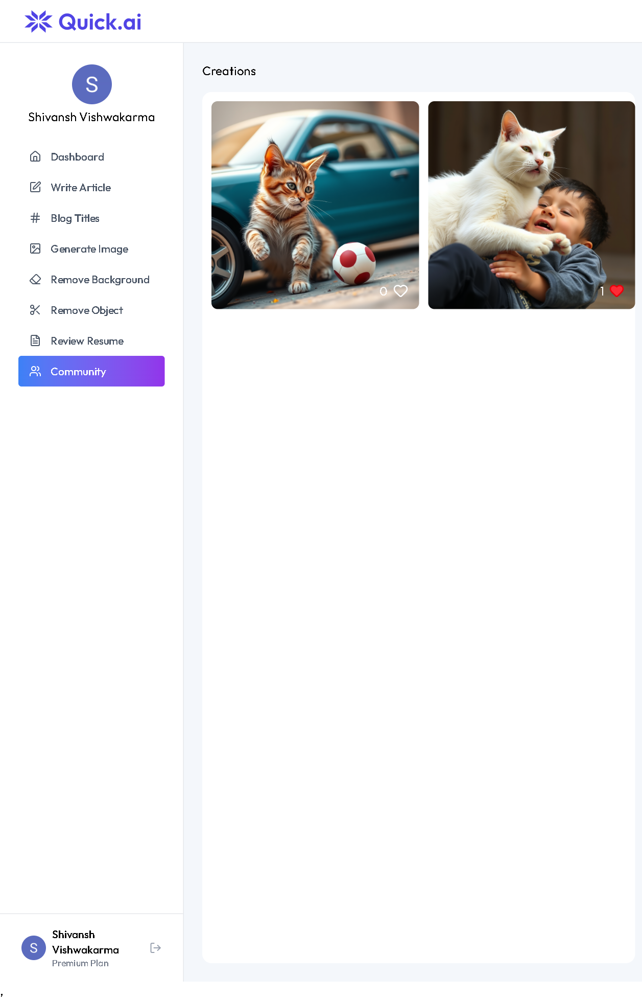
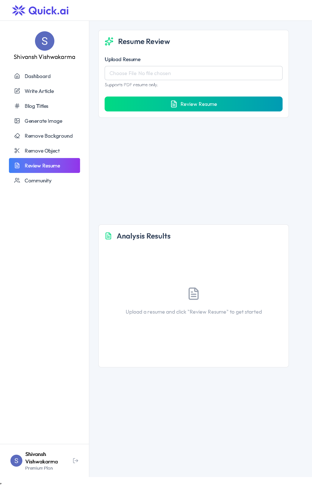

# 🚀 QuickAI: Advanced AI SaaS Platform

QuickAI is a high-performance, full-stack AI SaaS application designed to empower users with cutting-edge AI tools. Built with a modern tech stack, it offers seamless image generation, background removal, and a comprehensive dashboard integrated with a professional subscription system.

---
## 📸 App Preview
 ||  ||  ||  ||  ||  ||  || 
## 🔥 Key Features

### 🤖 AI Suite
- **Text-to-Image Generation**: Create high-fidelity images from natural language prompts using Generative AI.
- **Background Removal**: Instant, high-precision background removal for any image.
- **Object Removal**: Smart "scissors" tool to erase unwanted objects from your photos.
- **Resume Review**: AI-powered analysis to help users optimize their professional profiles.

### 💳 Subscription & Billing (Stripe)
- **Multi-Tier Plans**: Features both "Free" and "Premium" plans.
- **Automated Billing**: Fully integrated Stripe checkout and customer portal.
- **Prorated Cycles**: Handles cancellations and upgrades with real-time metadata updates.

### 🔐 Security & User Management (Clerk)
- **Modern Auth**: Social logins (Google, GitHub) and email-password authentication.
- **Plan Verification**: Server-side middleware checks for premium access before allowing API usage.
- **Public/Private Metadata**: Synchronized user data management across frontend and backend.

### 📊 User Experience
- **Dynamic Dashboard**: View all your recent creations and track usage limits.
- **Sidebar Navigation**: Clean, intuitive sidebar with active state tracking.
- **Responsive Design**: Built with Tailwind CSS for a flawless experience on Mobile, Tablet, and Desktop.

---

## 🛠️ Tech Stack

| Layer | Technology |
|---|---|
| **Frontend** | React.js (Vite), Tailwind CSS, Lucide React, Clerk React |
| **Backend** | Node.js, Express.js, Clerk SDK |
| **Database** | PostgreSQL / Neon DB (Prisma or SQL) |
| **Payments** | Stripe API (Checkout, Webhooks, Customer Portal) |
| **AI Integration** | Google Generative AI (Gemini), Cloudinary |

---

## 🚀 Getting Started

### 1. Installation & Setup

Clone the repository and install dependencies for both Frontend and Backend:

# Install Backend dependencies
cd server
npm install

## Install Frontend dependencies
cd ../client
npm install

```bash
# Clone the repository
git clone [https://github.com/technoshiva123/QuickAI.git](https://github.com/technoshiva123/QuickAI.git)
cd QuickAI

✍️ Author
Shivansh Vishwakarma
